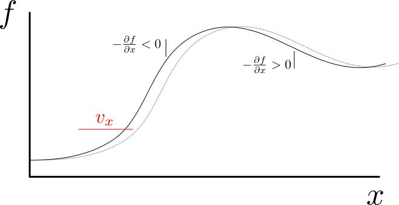
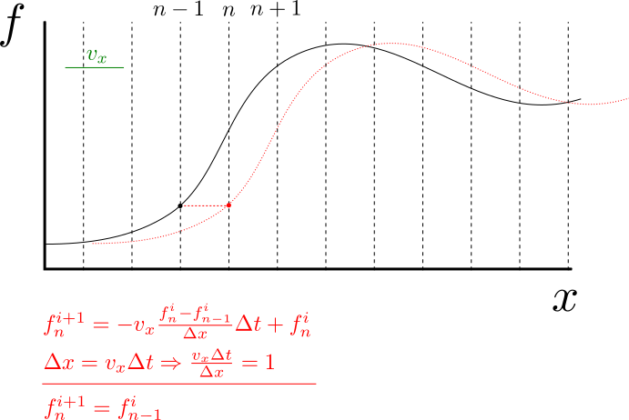
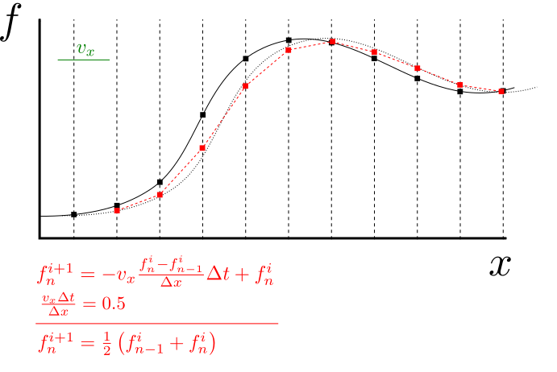

Advection
=========

The one-dimensional equation desccribing the advection of field :math:`f` is

.. math::
   \frac{\partial f}{\partial t} = -v_x \frac{\partial f}{\partial x}
   :label: adv-1d         

where :math:`v_x` is the velocity. The field :math:`f` can be many 
different things, for example: topography, chemical concentration,
temperature, etc. Despite its very simple appearance,
its numerical solutions often cause some (or a lot of) trouble.

.. topic:: Exercise

   Discretize equation :eq:`adv-1d` with forward difference
   in time, and

   - forward,
   - central,
   - backward difference in space.

   Illustration of the advection differential equation. The gradient
   of the function determines whether the function value
   will increase or decrease due to the advection.

   Illustration of the *upwind* FD advection solution
   with exact results caused by the right combination
   of time step, grid size and velocity. The value
   of the field at grid point :math:`n` is copied
   from the grid point :math:`n-1`. The function will retain
   its original form (limited only by the grid resolution)
   no matter how many times it is advected.
   
.. topic:: Terminology

   - *Upwind* advection scheme approximates the change in the function
     value by using the function gradient windward, on the side of the
     "incoming" flux.
   - *Downwind* advection scheme does the exact opposite and
     uses the gradient leeward, on the opposite side from
     the incoming flux.

.. _fig-adv-fd-upw-half:

   Illustration of the upwind FD advection solution 
   in a typical case where :math:`\frac{v_x\Delta t}{\Delta x} \ne 1`.
   Effectively, a linear interpolation between grid points
   is taking place, causing numerical diffusion in the solution.

   The amount of diffusion is proportional to the
   amount of time steps taken.

   Black line: Original field; dashed black line: advected field
   at next time step (exact solution); dashed red line: advected
   field at next time step (numerical solution).

.. topic:: Exercise

   - What will happen if :math:`\frac{v_x\Delta t}{\Delta x} > 1`?
   - Replace the upwind approximation used in Fig :numref:`fig-adv-fd-upw-half`
     with downwind approximation. How does the simplified expression
     for :math:`f_n^{i+1}` change? How would this change the final advected field?

.. topic:: Exercise

   Let's solve the 1D advection equation with finite differences. For testing
   purposes we will advect a simple step function :math:`f`:

   .. math::

      f = 0 \quad \mathrm{if}~x < 1 \\
      f = 1 \quad \mathrm{if}~x \ge 1

   The advection velocity :math:`v_x=1` will be positive, i.e. in direction
   of the :math:`x` axis. We will run the model for 8 (seconds, in model time).

   Use the following upwind discretization of the advection equation:

   .. math::

      \frac{f_n^{i+1}-f_n^i}{\Delta t} = -v_x\frac{f_n^i - f_{n-1}^i}{\Delta x}

   1. Rearrange the discretized equation so that you get an expression 
      for the function value of the next time step
   2. How many boundary conditions do you need? What are those?
   3. Create your python script: Either start one from scratch (possibly
      copying material from the previous scripts) or use 
      advection_upwind_template.py_ to get yourself going.
   4. Once your code is working, experiment with different combinations
      of :math:`\Delta x`, :math:`\Delta t` and :math:`v_x` to see
      how they affect the solution.

.. _advection_upwind_template.py: ../../../scripts/advection_upwind_template.py

