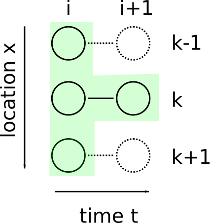

.. Finite differences method section

Finite differences formulation of the heat conduction problem
=============================================================

The full heat conduction-advection-production equation seen before
can be stated in 1D as 

.. math::
   \rho(x) C_p(x) \left( \frac{\delta T}{\delta t} + v_x \frac{\delta T}{\delta x} \right) = \frac{\delta}{\delta x} \left( \alpha(x) \frac{\delta T}{\delta x} \right) + H(x)
   :label: heat_eq_full

We can simplify equation :eq:`heat_eq_full` by assuming that there is no 
advection of heat and that all the physical properties are constant:

.. math::
   \rho C_p \frac{\delta T}{\delta t} = \alpha \frac{\delta^2 T}{\delta x^2} + H
   :label: heat_eq_noadv_const

.. topic:: Exercise

   How many boundary conditions are needed in order to solve this
   equation (either numerically or analytially)?

.. topic:: Exercise 

   Discretize the equation :eq:`heat_eq_noadv_const`. Use forward difference
   approximation in time (:math:`t`) and central difference approximation 
   in space (:math:`x`). Note that each variable has now two indices:
   one referring to the grid point in space, and in referring to the 
   grid point in time (i.e. the time step). For now, use index letter
   :math:`i` for time step and :math:`n` for grid point in space.

   Rearrange the discretized equation so that you end up with an expression
   for the temperature during next time step, i.e.

   .. math::
      T_n^{i+1} = \mathrm{function~of~} T_{n\pm k}^{i}

Like in the sphere-in-a-fluid example, we can draw a finite difference
stencil of the problem. 

.. _fig-stencil-heatdiff-simple:

   The temperature :math:`T_k^{i+1}` of the next time step
   will be calculated based on the three temperature values from the 
   previous time step. 

.. topic:: Exercise 

   Implement a python script that solves equation :eq:`heat_eq_noadv_const`
   using following problem setup:

   - We will model cooling of the oceanic lithosphere
   - Initial rock column (lithosphere) at the mid-ocean ridge will
     have a constant temperature of :math:`T_{\mathrm{ini}} = 1350` 
     (degrees Celsius) from the surface (:math:`x=0~\mathrm{km}`) to 
     the bottom of the lithosphere (:math:`x=100~\mathrm{km}`).
   - The boundary conditions are:

     + :math:`T_{\mathrm{surf}} = 0` at :math:`x=0`
     + :math:`T_{\mathrm{bott}} = 0` at :math:`x=100`

   - The whole lithosphere has constant physical properties:

     + Heat capacity :math:`C_p = 1250~\mathrm{J kg^{-1} K^{-1}}`
     + Density :math:`\rho = 3300~\mathrm{kg m^{-3}}`
     + Heat conductivity :math:`\alpha = 4.0~\mathrm{W m^{-1} K^{-1}}`

   1. Draw a sketch of the problem setup
   2. Draw a stencil that illustrates the grids in space and time:
      Draw the full stencil where you have total of six spatial grid points
      and six time steps. Number the grid point from zero to five
      (in both indices). Mark the grid points that are governed
      by the boundary or initial conditions, and those that will
      be calculated. 
   3. Copy the given code template :code:`heat_diff_template.py` to
      to :code:`my_heat_diff.py` (or something similar) and
      implement your own code. The structure of the code is already
      given, but a lot of code is missing in places marked
      with :code:`...`. Go through the code reading the comments 
      and instructions and implement the missing parts.

      + Note that the code template uses 'ix' for spatial index
        and 'it' for temporal index (short for "index-x" and
        "index-time").
      + Start with six time steps and six grid points in space,
        run the model for ten million years. You can vary these
        once the code works.

.. topic:: Exercise

   Start experimenting with your code:

   - Can you make it more exact (closer to the analytical solution)
     by making 
     
     + the spatial resolution higher?
     + the temporal resolution higher?

   - Are any combinations of :code:`nt` and :code:`nx` un-usable?
     What is their relation?

Von Neumann stability analysis
^^^^^^^^^^^^^^^^^^^^^^^^^^^^^^

EXTRA

Spatially varying physical parameters
=====================================

Above we assumed all the physical parameters are constant, i.e.
do not vary within the lithosphere. With this assumption many heat
conduction problems become relatively easy to solve analytically, 
without need to use any numerical methods. Of course, this assumption
is very strict and certainly not true within the heterogeneous lithosphere.
For example, crust and mantle have quite different thermal parameters: 
The more silicic crust does not conduct heat as easily as the iron-magnesium
rich mantle rock, and most of the heat producing element (U, Th, K) are
concentrated in the crust. 

.. topic:: Exercise

   If the thermal parameters are a function of position :math:`x`,
   the heat equation (without heat advection) has the following form.
   Transform the equation to its discretized form. Note that we
   have also added the heat generation term :math:`H`.

   Again, use forward difference approximation in time, 
   and central difference approximation in space.

   .. math::
      \rho(x) C_p(x) \frac{\delta T}{\delta t} = \frac{\partial}{\partial x} 
      \left( \alpha(x) \frac{\delta T}{\delta x} \right) + H(x)

Since the first order derivative of the temperature on the right hand side
can no more be combined, we are left with expressions like 
:math:`\alpha_{p}\frac{T_{n+1}-T_n}{\Delta x}` that approximate the
heat flow :math:`q_{n+½}` from grid point :math:`n` to :math:`n+1`. Here, :math:`\alpha_p` should be 
the conductivity value *between* the two grid points (:math:`p=n+½`), but it is 
not known since,
obviously, there is no grid point where conductivity could have been
defined. We can use linear interpolation, i.e.

.. math::
      \alpha_{n+½} = (\alpha_n + \alpha_{n+1})/2

However, this generates some inaccuracy since it is basically a smoothing
operation done on the conductivity field.

.. topic:: Exercise

   Why can not we decide to use the conductivity value
   from *either* grid point :math:`n` *or* grid point :math:`n+1`, 
   and use that consistently on each grid point? I.e. use the
   forward (backward) difference approximation

   .. math:: \frac{\partial T}{\partial x}|_{2½} = \alpha_2 \frac{T_3 - T_2}{\Delta x}

   .. math:: \frac{\partial T}{\partial x}|_{3½} = \alpha_3 \frac{T_4 - T_3}{\Delta x}

Staggered grids
^^^^^^^^^^^^^^^

A commonly used solution for the problem above is to use so called staggered 
grids. The basic idea is to start with an approach where some calculated
variables and/or physical parameters are defined *at different locations*
than the others.

The heat flow (:math:`q=-\alpha\frac{\partial T}{\partial x}`) is a good example: 
If we approximate the heat flow with a central difference over two grid points,
the resulting approximation is valid *between* those two grid points:

.. math:: q_{n+½} = \alpha_{n+½} \frac{T_{n+1}-T_n}{\Delta x}

Now, we can use the averaging method to get :math:`\alpha_{n+½}`. However, to
get the heat flow values at the grid points where all the other variables are 
defined, we need to interpolate them, too, from the "mid-points" back
to the main grid points.

To avoid too much interpolation and averaging, one can define different
grids for different variables. In the case of heat equation, natural choice
is to define :math:`T,~C_p` and :math:`\rho` at the *main grid points*, just
like we have done before. However, heat conductivity :math:`\alpha` 
and flow :math:`q` is 
defined on another grid that has grid points between the main grid points.
Heat conductivity and heat flow are not known (and need not to be known) at the main grid
points, and, on the other hand, the other variables are *only* known
at the main grid points.

.. figure:: img/stencil_heatdiff_staggered.svg

   A *staggered grid* for the solution of the heat diffusion problem,
   with four time steps and four spatial grid points.

   Circles mark the grid points that are used to define temperature,
   density, heat capacity, and heat production. Red circles: initial
   conditions, blue circles: boundary conditions. Crosses mark the
   grid points used to define heat conductivity and heat flow.

   The last row of heat conductivity values (i = 3) are *ghost points*
   and not used in the solution. The mid-point grid does not need to include
   those points, but for technical (code implementation related) reasons
   it is often easier to keep both grids the same size in all directions.

.. topic:: Exercise

   Write an finite differences expression using staggered grids
   to calculate the temperature at grid point :math:`n=2` time step
   :math:`i=3`. You should not need any "half-indices" or averaging
   of variables.

   .. math:: T_{2}^{3} = \mathrm{~...}

.. topic:: Exercise
   
   Script :code:`heat_diff_var.py` is almost ready implementation
   of the heat diffusion+production problem with variable
   physical parameters and a staggered grid. The structure is
   very similar to the template of the previous coding exercise. 

   1. Implement the missing lines of code at l. 96 to calculate
      the new temperature values.

   2. Modify the script for a new problem setup:

      + Instead of one layer crust, specify an upper and a lower crust
      + Set the upper crust heat production to :math:`2.5~\mathrm{µWm^{-3}}`,
        and the lower crust to :math:`1.0~\mathrm{µWm^{-3}}`

   3. Modify the script for yet another problem: Model the cooling of an intrusion of a hot
      sill in to mid-crust. This requires changing almost all of the parameters
      in the script but should not require any modifications to the actual
      finite-differences part (the time loop).

      + Model only the crustal part of the lithosphere, thickness 35 km.
      + Surface temperature is zero degrees celsius, moho temperature 600
        degrees.
      + At the beginning of the model, the sill has just intruded so that
        it occupies the depth from 7 km to 10 km.
      + The sill has an initial temperature of 1150 degrees (molten basalt)
      + The remaining of the crust has an initial temperature given by

        .. math::
           T(x) = -\frac{1}{2}\frac{H}{\alpha}x^2 + C_1 x 

        where

        .. math::
           C_1 = \left( T_{\mathrm{bott}} + \frac{1}{2}\frac{H}{\alpha}L^2 \right) / L

        (See :code:`example_element-multiplication.py` for an
        example of function evaluation in python)

      Use following physical parameters to start with:

      + Intrusion: 
        
        * :math:`\alpha = 4.0`
        * :math:`\rho = 3200`
        * :math:`C_p = 1250`
        * :math:`H=10^{-6}`

      + Rest of the crust:

        * :math:`\alpha = 2.5`
        * :math:`\rho = 2900`
        * :math:`C_p = 800`
        * :math:`H=10^{-6}`
      

      Things to consider:

      + How high spatial *resolution* do you need?
      + How long do you estimate the model needs to run in order to cool
        down the whole sill? How many time steps do you need?

