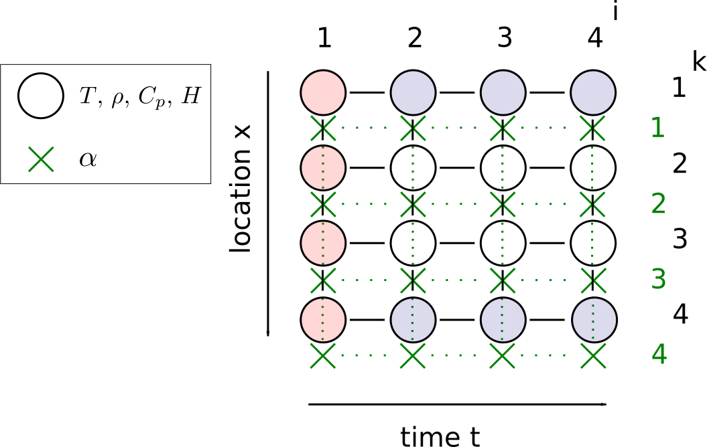
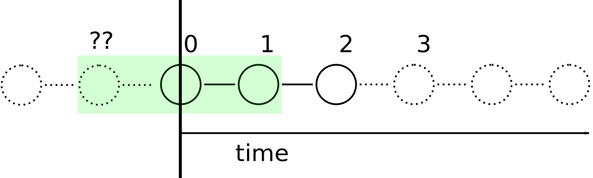

.. Finite differences method section

Heat conduction and production
==============================

.. topic:: Exercise

   Transform the following differential equation in to 
   its discretized form.

   Use *forward difference* approximation in time, 
   and central difference approximation in space.

   .. math::
      \rho C_p \frac{\delta T}{\delta t} = \alpha \frac{\delta^2 T}{\delta x^2}

.. topic:: Exercise

   Implement your discretization in :code:`heat_diff_1.py` (l. 57).

   Note that whereas in the falling sphere example the variable was
   time only, here both time and location vary. Thus, the temperature
   array in the python code is 2-dimensional: You can refer to the 
   grid point *k* time step *i* by using expression :code:`T[k,i]`.

Spatially varying physical parameters
^^^^^^^^^^^^^^^^^^^^^^^^^^^^^^^^^^^^^

.. topic:: Exercise

   Transform the following differential equation in to 
   its discretized form.

   Use *forward difference* approximation in time, 
   and *central difference* approximation in space.

   .. math::
      \rho(x) C_p(x) \frac{\delta T}{\delta t} = \frac{ \alpha(x) \frac{\delta T}{\delta x} }{\delta x} + H(x)

   A *staggered grid* for the solution of the heat diffusion problem,
   with four time steps and four spatial grid points.

   Circles mark the grid points that are used to define temperature,
   density, heat capacity, and heat production. Red circles: initial
   conditions, blue circles: boundary conditions. Crosses mark the
   grid points used to define heat conductivity. 

   The last row of heat conductivity values (i = 4) are *ghost points*
   and not used in the solution. 

Equation :eq:`fd_deriv_approx_cnt` can be generalized as 

.. math::
   \frac{\mathrm{d}f}{\mathrm{d}x}\rvert_{x=x_i} \approx \frac{ f(x_{i+½}) - f(x_{i-½})}{x_{i+½} - x_{i-½}}
   :label: fd_deriv_approx_cnt_gen

Where :math:`i` is an integer. In other words, the indices can be added or 
subtracted with any number and the approximation still holds, as long as the 
addition/subtraction is done on each index in the equation.

.. topic:: Exercise

   Write a central difference approximation for :math:`\frac{\mathrm{d}f}{\mathrm{d}x}|_{x=x_{15}}`

The central difference approximation can also be written as

.. math::
   \frac{\mathrm{d}f}{\mathrm{d}x}\rvert_{x=x_i} \approx \frac{ f(x_{i+1}) - f(x_{i-1})}{x_{i+1} - x_{i-1}}

and although generally producing a different value than :eq:`fd_deriv_approx_cnt_gen`
is still a valid approximation.

The points :math:`x_1, x_2, x_3, ...` at which the function :math:`f` is 
evaluated and the derivative approximated, are called *grid points*. The 
locations of the grid points are chosen differently depending on the problem
one is solving, but they must be in order, so that for all pairs of :math:`j`
and :math:`k`, if :math:`j > k` then :math:`x_j > x_k` (decreasing order
is also possible but not usually used). These are the points at which the final
solution to the problem (i.e. value of :math:`f` in the case above) is 
to be found.

Often, a *regular grid* is used. In this case :math:`\Delta x = x_{i+1} - x_i`
for *all* :math:`i`, i.e. the distance between two consequent grid points is 
always the same. 

Conventionally, grid points have indices of integers (0, 1, 2, 3, etc.). 
Half-indices, like above, may be used in process of deriving the finite
differences equation and often required in case of higher order derivatives
and/or when using so called staggered grids (see later). The value of a
variable in-between two grid points can be found by taking averages, for
example

.. math::
   x_{i+½} = \frac{x_i + x_{i+1}}{2} ,
   :label: eq_between_gridpoints

i.e. assuming linear interpolation between grid points.

Simple example: Throwing a ball
-------------------------------

Imagine a man throwing a ball. Let us neglect the 
resistance by the air and concentrate on the vertical velocity and
location of the ball only. The ball leaves the man's hand at 
velocity :math:`V_0` with vertical component :math:`V_{z,0}` at moment 
:math:`t=t_0`.

**How long will the ball stay in the air?**

We know that the vertical velocity of the ball will start to decrease
and then turn downwards due to the gravitation. Thus, the velocity
of the ball at any given time :math:`t` after the throw is 
:math:`V_z(t) = V_{z,0} - ½gt^2`.

The simple equation describing the derivative of the vertical location of 
the ball (i.e. its vertical speed) is

.. math::

   \frac{\mathrm{d}z}{\mathrm{d}t} = V_{z,0} - ½gt^2

we can *discretize* this equation using forward difference 
:eq:`fd_deriv_approx_fwd` and thus get

.. math::

   \frac{z_{i+1} - z_i}{t_{i+1} - t_i} = V_{z,0} - ½gt_i^2 .

Note that also the time on the right hand side now refers to a time
at some grid point :math:`i`. We can rearrange the equation to

.. math::

   z_{i+1} = (V_{z,0} - ½gt_i^2) (t_{i+1} - t_i) + z_i

which shows that if we know the location of the ball (:math:`z_i`) at moment
:math:`t_i`, we can calculate its next position :math:`z_{i+1}` at time
:math:`t_{i+1}`, after :math:`\Delta t` seconds.

Let's assume the ball leaves the player's hand at :math:`z_0 = 1.8~\mathrm{m}`
at vertical velocity :math:`V_{z,0} = 15~\mathrm{ms^{-1}}`. Let's first
calculate what is the ball's elevation after 3 seconds.

We will first choose to divide the time into *time steps* (i.e.
grid spacing) of 0.5 seconds, which will lead to seven grid points.

   ======== ===== =====
   t (s)    z (m) i
   ======== ===== =====
   0.0      1.8   0
   0.5            1
   1.0            2
   1.5            3
   2.0            4
   2.5            5
   3.0            6
   ======== ===== =====

It is important to keep in mind that the *grid index* (:math:`i`), which is an 
order number, is separate from the physical values, such as :math:`t_i` or :math:`z_i`.
We already know the time and location at time step zero, so we can calculate
the location at next time step 

.. math::

   z_1 &= (V_{z,0} - ½gt_0^2) (t_1 - t_0) + z_0 \\
       &= (15 - ½ g \times 0.0^2) (0.5) + 1.8 \\
       &= 9.3

After we know :math:`z_1`, we can go continue and calculate :math:`z_2`

.. math::

   z_2 &= (V_{z,0} - ½gt_1^2) (t_2 - t_1) + z_1 \\
       &= (15 - ½ g \times 0.5^2) (0.5) + 9.3 \\
       &= 16.19

and so on, until we reach :math:`z_6`:

   ======== ===== =====
   t (s)    z (m) i
   ======== ===== =====
   0.0      1.8   0
   0.5      9.3   1
   1.0      16.19 2
   1.5      21.23 3
   2.0      23.22 4 
   2.5      20.91 5
   3.0      13.08 6
   ======== ===== =====

.. topic:: Exercise

   Why bother doing the calculations in six steps? Why not take
   only one step with time step :math:`\Delta t = 3\mathrm{~s}`?
   What would the result be? How does it compare to the six-step
   solution?

Following is a small Python code snippet that can be used to calculate
the ball's elevation like we just did. You can adjust the starting elevation,
the initial velocity, the number of steps to calculate and the total time
to calculate.

.. literalinclude:: ../../scripts/ball.py
   :language: python

.. topic:: Exercise

   Experiment with the code snippet: Vary the four parameters and
   see what is the effect of large or small number of steps taken.
   Can you estimate how long does it take for the ball to return
   back to the ground, by varying the number of steps and total time?

Less simple example: Falling sphere in a fluid
----------------------------------------------

In the following, we will use finite differences to solve a simple ordinary
differential equation that describes how a solid ball falls down within
a viscous fluid.

**Stokes' law** relates the frictional resistance of a falling sphere in a viscous 
fluid to the velocity of the sphere:

.. math::

   F_D = -6 \pi \eta R v

where :math:`F_D` is the frictional force, :math:`\eta` viscosity of the 
surrounding fluid, :math:`R` radius of the sphere, and :math:`v` velocity
of the sphere. This force is directed opposite to the direction of the 
velocity (thus the minus sign).

Additionally, we know the gravitational force experienced by the sphere:

.. math::

   F_g = -m g ,

and the buoyancy force as a function of density of the fluid, :math:`\rho_f`:

.. math::

   F_b = \frac{4}{3}\pi R^3 \rho_f g . 

Here, :math:`m` is the mass of the sphere, and :math:`g` acceleration of
gravity (:math:`F_g` is negative since we have set our z axis to point upwards). 
The sum of forces experienced by the sphere is thus 
:math:`F_s = F_b + F_g + F_D`, and noting that :math:`F_s = m a_s` we arrive at

.. math:: m \frac{\mathrm{d}^2 z}{\mathrm{d} t^2} = F_b + F_g - 6 \pi \eta R \frac{\mathrm{d} z}{\mathrm{d} t} 
   :label: eq_stokes_sphere

where :math:`z` is the position (height) of the sphere, and :math:`t` time. This
differential equation has an analytical solution [#fd_stokes_analytical]_, but we
will use finite differences method to solve the equation.

Applying finite differences
^^^^^^^^^^^^^^^^^^^^^^^^^^^

The derivatives of :math:`z` in equation :eq:`eq_stokes_sphere` can be 
approximated using finite differences:

.. math:: \frac{\mathrm{d} z}{\mathrm{d} t}|_{t=t_i} \approx \frac{z_{i+½} - z_{i-½}}{t_{i+½} - t_{i-½}} 
   :label: fd_approx

where :math:`t_{i-½}` and :math:`t_{i+½}` are two moments in time, so that 
:math:`\Delta t = t_{i+½} - t_{i-½}` is small. Here 
we have evaluated the derivative (or its approximation) at 
mid-point between :math:`t_{i+½}` and :math:`t_{i-½}`. Why we have
chosen to use "half-steps" instead of full steps :math:`i \pm 1`
becomes apparent soon.

The second order derivative can be approximated by applying the same rule 
twice. First,

.. math::

   \frac{\mathrm{d}^2 z}{\mathrm{d} t^2}|_{t=t_i} \approx \frac{ \frac{\mathrm{d} z}{\mathrm{d} t}|_{t=t_{i+½}} - \frac{\mathrm{d} z}{\mathrm{d} t}|_{t=t_{i-½}} }{ t_{i+½} - t_{i-½} } .

Then the same rule :eq:`fd_approx` is applied to the first order derivatives within this quotient:

.. math::
   \frac{\mathrm{d}^2 z}{\mathrm{d} t^2}|_{t=t_i} \approx \frac{ \frac{z_{i+1} - z_i}{t_{i+1} - t_i} - \frac{z_i - z_{i-1}}{t_i - t_{i-1}} }{ t_{i+½} - t_{i-½} }
   :label: fd_2nd_approx_stokes

Note that the first order derivatives in the dividend are evaluated between the the grid points, 
at :math:`i+½` and :math:`i-½`, which is why the time values in the divisor are chosen at
"half-steps", as well (so that their mid-point is at grid point :math:`i` exactly).
Assuming a regular grid (:math:`t_{i+1} - t_i = t_i - t_{i-1} = t_{i+½} - t_{i-½} = \Delta t`) 
we get, after simplification,

.. math::
   \frac{\mathrm{d}^2 z}{\mathrm{d} t^2}|_{t=t_i} \approx \frac{ z_{i+1} - 2z_i + z_{i-1}}{\Delta t^2} .
   :label: eq_stokes_sphere_d2zdt2

Likewise, eq. :eq:`fd_approx` can be written as

.. math::
   \frac{\mathrm{d} z}{\mathrm{d} t}|_{t=t_i} \approx \frac{z_{i+1} - z_{i-1}}{2\Delta t}
   :label: eq_stokes_sphere_dzdt

Here, we have applied eq. :eq:`eq_between_gridpoints` to the "half-indices".
Now, :eq:`eq_stokes_sphere_d2zdt2` and :eq:`eq_stokes_sphere_dzdt` can be plugged in to 
the differential equation :eq:`eq_stokes_sphere` describing the fall of the sphere:

.. math:: m \frac{ z_{i+1} - 2z_i + z_{i-1}}{\Delta t^2} = F_b + F_g  - 6 \pi \eta R \frac{z_{i+1} - z_{i-1}}{2\Delta t} .
   :label: eq_stokes_sphere_discr

This is called the *discretized* version of equation :eq:`eq_stokes_sphere`. Note
that both differentials are approximated at the same grid point :math:`i`. This
must be true whenever approximating a differential equation with finite
differences. For convenience, let us mark :math:`A = -6 \pi \eta R` and then rearrange 
:eq:`eq_stokes_sphere_discr` to

.. math::
   z_{i+1}\left(\frac{m}{\Delta t^2} - \frac{A}{2\Delta t}\right) + z_i\left(\frac{-2m}{\Delta t^2}\right) + z_{i-1}\left(\frac{m}{\Delta t^2} + \frac{A}{2\Delta t}\right) = F_b + F_g
   :label: eq_stokes_sphere_discr2

Since we know :math:`m` and :math:`A`, we can always rearrange the equation to
solve for the location of the sphere :math:`z_{i+1}` if we know its two
previous locations :math:`z_i` and :math:`z_{i-1}` at times :math:`t_i`
and :math:`t_{i-1}`. 

Boundary (initial) conditions
^^^^^^^^^^^^^^^^^^^^^^^^^^^^^

In the example of a man throwing a ball we knew the
ball's location :math:`z_0` at some moment :math:`t_0`, and
could calculate all the consequent time steps. Here knowing one location
at one moment in time is not enough since we need to know the ball's
location during *two* consequent time steps before we can start to calculate
the next location. 

.. topic:: Exercise

   Why can't we simply say that the ball has been kept in place for some definite
   amount of time before it is released, i.e. that :math:`z_{i\leq 0} = 0` at 
   any :math:`t \leq t_0` and and then use eq. :eq:`eq_stokes_sphere_discr2` 
   to calculate :math:`z_1`?

However, we do know the ball's initial location :math:`z_0` at some moment :math:`t_0`.
We also know that at that time the ball's velocity is zero, since it is just
about to start the fall. The latter condition can be re-stated and discretized

.. math::

   v(t=t_0) &= 0 \\
   \frac{\mathrm{d}z}{\mathrm{d}t}|_{t=t_0} &= 0 \\
   \frac{z_1 - z_{-1}}{t_1 - t_{-1}} &= 0 \\
   \Rightarrow z_{-1} &= z_1 .

Now, when we try to calculate :math:`z_1` using :eq:`eq_stokes_sphere_discr2`
but only know the ball's initial location :math:`z_0` at time :math:`t_0` we 
can replace the unknown :math:`z_{-1}` by :math:`z_1`.

During the subsequent timestep calculations for :math:`z_2, z_3, ...` we
can use :eq:`eq_stokes_sphere_discr2` directly since we already know
the two previous elevations.

The conditions we have used, that :math:`z=0` at :math:`t=0`, and that
:math:`\frac{\mathrm{d}z}{\mathrm{d}t}=0` at :math:`t=0` are called
the *boundary conditions* of the problem, and, since the variable
here is time, can also be called *initial conditions*. The discretized
versions of these (:math:`z_0 = 0` and :math:`\frac{z_1 - z_{-1}}{t_1 - t_{-1}} = 0`)
are needed in order to use the discretized version of the differential
equation itself. The number of boundary/initial conditions needed depends
on the order of the differential and on the dimensions of the problem.
Here we needed two (second order in one dimension, time).

   *Stencil* of the finite differences approximation for the problem
   of a ball falling within a fluid. In order to calculate :math:`i+1`
   we need to know :math:`i` and :math:`i-1`.

   Stencil of the finite differences approximation illustrating
   the boundary (initial) condition requirement.

.. topic:: Exercise

   Let us assume the sphere has been placed in the fluid and then
   released at time :math:`t_0 = 0\mathrm{~ms}`. At what elevation 
   :math:`z_{1}` will the sphere be at time :math:`t_{1}`, 0.5 ms after its 
   release? What about at :math:`t_{2}`, 1 ms after its release?

   Use following parameters:

      - fluid viscosity: 100 Pa s (honey)
      - fluid density: 1000 kg/m\ :sup:`3`
      - sphere density: 7750 kg/m\ :sup:`3` (steel)
      - sphere radius: 2 cm
      - time step (grid spacing), :math:`\Delta t`: 0.5 ms

   *Hint*: For some simplification, you may want to fix the coordinates so that
   the initial elevation equals 0 m.

.. topic:: Exercise

   Modify the script :code:`falling_sphere.py` so that you implement
   the discretized equation :eq:`eq_stokes_sphere_discr2`. Fill in the two 
   lines (l. 64 and l. 69) so that the next elevation will be calculated.

   Once the code works, vary the number of time steps and the size
   of the time step, and compare the results to the given analytical 
   solution.

.. rubric::Footnotes

.. [#fd_taylor] The finite differences method can also be thought as an approximation 
   for the function by Taylor series expansion where higher order terms have 
   been omitted.

.. [#fd_stokes_analytical] Let's rewrite the equation in form

   .. math::
      
      z'' + B_1 z' = B_2

   where :math:`B_1 = \frac{6\pi\eta R}{m}` and :math:`B_2 = \frac{F_b + F_g}{m}`.
   By replacing :math:`y = z'` the differential equation becomes first order
   
   .. math::

      y' + B_1 y = B_2

   which has a general solution 

   .. math ::

      y = \frac{\int u(t) q(t) \mathrm{d}t + C}{ u(t) } , ~~~
      u(t) = e^{\int p(t) \mathrm{d}t} .
   
   Here, :math:`p(t) = B_1` and :math:`q(t) = B_2`, and thus

   .. math :: 

      y = \frac{B_2}{B_1} + C_1 e^{-B_1 t}

   where :math:`C_1` is found by using the condition 
   :math:`v = \frac{\mathrm{d}z}{\mathrm{d}t} = y = 0` when :math:`t=0`, and
   results in 
   
   .. math ::

      y = \frac{B_2}{B_1}(1 - e^{-B_1 t})

   Since this is also :math:`z'` we find :math:`z` by integrating :math:`y` 
   once to get

   .. math::

      z = \frac{B_2}{B_1}\left( t + e^{-B_1 t} / B_1 + C_2 \right) ,

   where :math:`C_2` is found by using the condition :math:`z=0` at :math:`t=0`.

   The final solution is thus

   .. math ::

      z = \frac{B_2}{B_1}\left( t + \frac{1}{B_1}e^{-B_1 t} + \frac{B_1 z_0}{B_2} - \frac{1}{B_1} \right)

