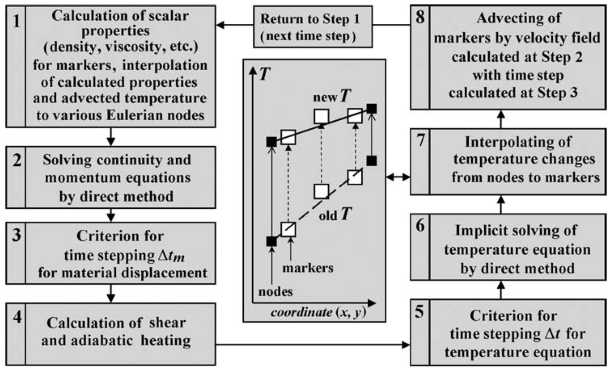

.. putting it together section

Putting it together
===================

In the past four days we have been introduced to a number of topics related to geodynamic modelling:

- Physical processes
- Solving equations
- Programming concepts in Python/NumPy
- Numerical methods
- Benchmarking numerical solutions

Now we turn to how these different topics are related to one another in our design of a 2D thermomechanical numerical geodynamic model.
As we will see, there are a number of different factors we must consider in the model design, and the order in which we perform various actions is important.

Processes to consider
---------------------

First off, what kinds of processes do we need to consider in our 2D geodynamic numerical modelling code?

- Heat transfer in 2D
   - Conduction
   - Production
   - Advection
   - Material thermal properties
       - Thermal conductivity
       - Concentration of heat-producing elements
       - Heat capacity
- Stokes flow
   - Momentum and continuity equations
   - Material mechanical properties
       - Viscosity
- Material advection (related to of Stokes flow)

Interactions between processes/materials
----------------------------------------

How might various processes we consider above interact with one another?
This is an important consideration because we need to know in which order we should handle the different processes.
In the Earth, materials move and transfer heat simultaneously, but in our model we will solve the Stokes flow and heat transfer equations separately.

- Stokes flow solution will affect advection in heat transfer code
- Temperature will affect viscosity of model materials
- Velocities from Stokes flow will influence size of time step for material advection

Structure of a 2D thermomechanical code
---------------------------------------

With the list of processes and their interactions given above, how should we design our numerical modelling code?
In what order should we do the different steps?

**Figure 1**. An example of a flow chart for the steps needed to simulate geodynamic processes in 2D.

Above we see an example of the order in which various processes and numerical procedures should be executed.
Notably, we calculate the velocities for Stokes flow first, temperature after that (using the Stokes flow velocities), and move the markers after the new temperature values have been interpolated onto them.
Note that in our code we will not perform step 4 above.

Limitations
-----------

Given the various physical processes we have discussed earlier in the course, and the model design described above, what are the potential limitations of our 2D model?

- 2D, so no three-dimensional deformation
- No plasticity, no elasticity
